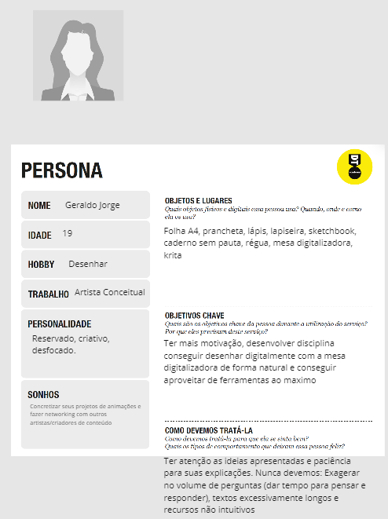

# Informações do Projeto
`TÍTULO DO PROJETO`  

Chillout

`CURSO` 

Ciência da Computação

## Participantes

- André Scianni Pereira
- Carlos Vinícius de Souza Coelho
- Fernando Wagner Gomes Salim
- Paulo Henrique Marques de Menezes
- Vítor Varela Chausson

# Estrutura do Documento

- [Informações do Projeto](#informações-do-projeto)
  - [Participantes](#participantes)
- [Estrutura do Documento](#estrutura-do-documento)
- [Introdução](#introdução)
  - [Problema](#problema)
  - [Objetivos](#objetivos)
  - [Justificativa](#justificativa)
  - [Público-Alvo](#público-alvo)
- [Especificações do Projeto](#especificações-do-projeto)
  - [Personas e Mapas de Empatia](#personas-e-mapas-de-empatia)
  - [Histórias de Usuários](#histórias-de-usuários)
  - [Requisitos](#requisitos)
    - [Requisitos Funcionais](#requisitos-funcionais)
    - [Requisitos não Funcionais](#requisitos-não-funcionais)
  - [Restrições](#restrições)
- [Projeto de Interface](#projeto-de-interface)
  - [User Flow](#user-flow)
  - [Wireframes](#wireframes)
- [Metodologia](#metodologia)
  - [Divisão de Papéis](#divisão-de-papéis)
  - [Ferramentas](#ferramentas)
  - [Controle de Versão](#controle-de-versão)
- [**############## SPRINT 1 ACABA AQUI #############**](#-sprint-1-acaba-aqui-)
- [Projeto da Solução](#projeto-da-solução)
  - [Tecnologias Utilizadas](#tecnologias-utilizadas)
  - [Arquitetura da solução](#arquitetura-da-solução)
- [Avaliação da Aplicação](#avaliação-da-aplicação)
  - [Plano de Testes](#plano-de-testes)
  - [Ferramentas de Testes (Opcional)](#ferramentas-de-testes-opcional)
  - [Registros de Testes](#registros-de-testes)
- [Referências](#referências)

# Introdução

## Problema

Dois problemas que acometem muitos profissionais hoje em dia, principalmente aqueles que trabalham com criação de conteúdo são o bloqueio criativo e o burnout. A dificuldade de cumprir prazos com um trabalho que exige criatividade e inspiração é algo que sobrecarrega bastante profissionais da área e pessoas em situações parecidas. A desorganização da rotina de criação é uma dasprincipais raízes desses problemas, já que um dia a dia muito cansativo atrapalha a busca por inspiração. O programa, projetado para o uso dessas pessoas, ajudaria nessa organização e na inspiração dessas pessoas.

## Objetivos

O foco principal do software que iremos desenvolver é auxiliar as pessoas na busca por inspiração e na organização do tempo, diminuindo o bloqueio criativo e burnout. Ele será desenvolvido com criadores de conteúdo como músicos, desenhistas e influenciadores sendo o principal público em mente, portanto outros objetivos do projeto são: fornecer sugestões de cores para desenhistas baseadas em teorias já existentes sobre o assunto; organizar rotinas de prática de habilidades específicas para músicos e desenvolver modelos de listas de tarefas baseados na profissão ou hobby do usuário.

## Justificativa

Na atualidade, as pessoas são cobradas constantemente com entrega de produtos, uma vez que o mundo moderno exige cada vez mais que as pessoas se adaptem rapidamente e estejam dispostas a atender as necessidades da sociedade. Essa cobrança constante gera problemas como o burnout e o bloqueio criativo, que acometem principalmente aqueles que trabalham com criação de conteúdo, prejudicando o sucesso de artistas, músicos e outros profissionais da área. Diante dessa situação resolvemos desenvolver um software que auxiliasse na organização do tempo dessas pessoas, diminuindo a sobrecarga constante que causa os problemas descritos. Escutamos relatos de profissionais que trabalham nessa área e há um consenso de que esses são problemas comuns e difíceis de lidar. Optamos por um programa de organização de tempo com sugestões baseadas na profissão do usuário para entregar um atendimento especializado aos usuários, focando em problemas reais e específicos que os acometem.

## Público-Alvo

O público alvo do nosso projeto é composto principalmente de criadores de conteúdo, mais especificamente músicos, desenhistas, pintores, escritores, roteiristas, artistas no geral e influenciadores, exercendo a criação como profissão ou como hobby. É recomendado que o usuário tenha conhecimento prévio da área, porém o software também será útil para iniciantes. Nosso público alvo também é esperado que esteja imerso nas tecnologias atuais, com acesso a pelo menos um smartphone e um computador. 

 
# Especificações do Projeto

Essa parte do relatório foi responsável por nos guiar a entender quem sofre do nosso problema, nas perspectivas deles, para que assim nos possamos encontrar uma solução para o problema.

## Personas e Mapas de Empatia

>**Músico**
>
>
>    

>**Criador de conteúdo**
>
>
>    

>**Artista conceitual**
>
>
>    

## Histórias de Usuários

Com base na análise das personas forma identificadas as seguintes histórias de usuários:

|EU COMO... `PERSONA`| QUERO/PRECISO ... `FUNCIONALIDADE` |PARA ... `MOTIVO/VALOR`                 |
|--------------------|------------------------------------|----------------------------------------|
|Criador de conteudo | Inspirações de memes               | Criar videos de entretenimento          |
|Criador de conteudo | Registrar cronograma de uploads     | Organizar meu tempo de produção        |
|Musico              | Organizar rotinas de trabalho/lazer | Conseguir organizar minha mente para projetos |
|Artista conceitual  | Integrar minhas artes digitalmente  | Aproveitar o maximo de ferramentas digitais         |

## Requisitos

As tabelas que se seguem apresentam os requisitos funcionais e não funcionais que detalham o escopo do projeto.

### Requisitos Funcionais

|ID    | Descrição do Requisito  | Prioridade |
|------|-----------------------------------------|----|
|RF-001| Permitir que o usuário cadastre TODO-LISTS | ALTA | 
|RF-002| Permitir que o usuário cadastre ideias| ALTA | 
|RF-003| Permitir que o usuário lance seus cronogramas  | MÉDIA |
|RF-004| Preset de lista de acordo com profissão | MÉDIA | 
|RF-005| Ajudar com inspirações criativas externas | BAIXO | 
|RF-006| Integração com mesas digitais | BAIXO | 
|RF-007| Layout vertical, igual de rede social | BAIXO | 

### Requisitos não Funcionais

|ID     | Descrição do Requisito  |Prioridade |
|-------|-------------------------|----|
|RNF-001| Compatibilidade multi-plataforma | MÉDIA | 
|RNF-002| Chamadas em API externas para exibir inspirações  |  MÉDIA | 
|RNF-003| Desenhar com mesa digitai | MÉDIA | 

## Restrições

O projeto está restrito pelos itens apresentados na tabela a seguir.

|ID| Restrição                                             |
|--|-------------------------------------------------------|
|01| O projeto deverá ser entregue até o final do semestre |
|02| Não pode ser desenvolvido um módulo de backend        |
|03| Não entregar ideias completamente finalizadas     |
|04| Os recursos do projeto devem ser intuitivos       |

# Projeto de Interface

......  COLOQUE AQUI O SEU TEXTO DE INTRODUÇÃO ......

> Apresente as principais interfaces da solução. Discuta como 
> foram elaboradas de forma a atender os requisitos funcionais, não
> funcionais e histórias de usuário abordados nas [Especificações do
> Projeto](#especificações-do-projeto).

## User Flow

......  INCLUA AQUI O DIAGRAMA COM O FLUXO DO USUÁRIO NA APLICAÇÃO ......

> Fluxo de usuário (User Flow) é uma técnica que permite ao desenvolvedor
> mapear todo fluxo de telas do site ou app. Essa técnica funciona
> para alinhar os caminhos e as possíveis ações que o usuário pode
> fazer junto com os membros de sua equipe.
>
> **Links Úteis**:
> - [User Flow: O Quê É e Como Fazer?](https://medium.com/7bits/fluxo-de-usu%C3%A1rio-user-flow-o-que-%C3%A9-como-fazer-79d965872534)
> - [User Flow vs Site Maps](http://designr.com.br/sitemap-e-user-flow-quais-as-diferencas-e-quando-usar-cada-um/)
> - [Top 25 User Flow Tools & Templates for Smooth](https://www.mockplus.com/blog/post/user-flow-tools)
>
> **Exemplo**:
> 
> 

## Wireframes

......  INCLUA AQUI OS WIREFRAMES DAS TELAS DA APLICAÇÃO COM UM BREVE DESCRITIVO ......

> Wireframes são protótipos das telas da aplicação usados em design de interface para sugerir a
> estrutura de um site web e seu relacionamentos entre suas
> páginas. Um wireframe web é uma ilustração semelhante ao
> layout de elementos fundamentais na interface.
> 
> **Links Úteis**:
> - [Ferramentas de Wireframes](https://rockcontent.com/blog/wireframes/)
> - [Figma](https://www.figma.com/)
> - [Adobe XD](https://www.adobe.com/br/products/xd.html#scroll)
> - [MarvelApp](https://marvelapp.com/developers/documentation/tutorials/)
> 
> **Exemplo**:
> 
> 

# Metodologia

O grupo utilizou para o Design Thinking as ferramentas disponibilizadas pelos professores:

 - Matriz CSD
 - Mapa de Stakeholders
 - Diagrama de personas
 - Mural de possibilidades
 - Mapa de priorização

E para discutirmos sobre o que será feito e para dividirmos as tarefas foram utilizados:

 - WhatsApp
 - Discord
 - Trello

## Divisão de Papéis

### Scrum Master

### Product Owwner

 - Professores

### Equipe de Desenvolvimento

 - André Scianni
 - Carlos Vinícius
 - Fernando Wagner
 - Paulo Henrique
 - Vítor Varela

## Ferramentas

| Ambiente  | Plataforma              |Link de Acesso |
|-----------|-------------------------|---------------|
|Processo de Design Thinkgin  | Miro |  https://miro.com/app/board/uXjVPWjVjz0=/?share_link_id=40117820975 | 
|Repositório de código | GitHub | https://github.com/ICEI-PUC-Minas-PPLCC-TI/tiaw-ppl-cc-m-20222-06-bloqueio-criativo-burnout |  
|Protótipo Interativo | Figma | https://figma.com/XXXXXXX |
|Editor de código | VS Code |
|Ferramentas de Comunicação | Discord e WhatsApp |
|Plataforma de Hospedagem | Github Pages | https://figma.com/XXXXXXX |

Para o protótipo interativo foi escolhido o Figma, pois um dos membros tem mais familiaridade com a plataforma. O editor de código escolhido foi o VS Code por ter integração com o git e possuir também outras funcionalidade que agilizam o trabalho. As ferramentas de comunicação escolhidas são Discord e WhatsApp por serem muito utilizadas pelos membros do grupo. E a plataforma de hospedagem escolhida foi o GitHub Pages pela sua integração com o GitHub.

<!-- | Ambiente  | Plataforma              |Link de Acesso |
|-----------|-------------------------|---------------|
|Processo de Design Thinkgin  | Miro |  https://miro.com/XXXXXXX | 
|Repositório de código | GitHub | https://github.com/XXXXXXX | 
|Hospedagem do site | Heroku |  https://XXXXXXX.herokuapp.com | 
|Protótipo Interativo | MavelApp ou Figma | https://figma.com/XXXXXXX | --> 

## Controle de Versão

O projeto segue a seguinte convenção para o nome de branchs:

 - `master`: versão estável já testada do software
 - `testing`: versão em testes do software
 - `dev`: versão de desenvolvimento do software

Para a gerência de issues, a seguinte convenção para etiquetas foi adotada:

- `bugfix`: uma funcionalidade encontra-se com problemas
- `enhancement`: uma funcionalidade precisa ser melhorada
- `feature`: uma nova funcionalidade precisa ser introduzida

# **############## SPRINT 1 ACABA AQUI #############**

# Projeto da Solução

......  COLOQUE AQUI O SEU TEXTO ......

## Tecnologias Utilizadas

......  COLOQUE AQUI O SEU TEXTO ......

> Descreva aqui qual(is) tecnologias você vai usar para resolver o seu
> problema, ou seja, implementar a sua solução. Liste todas as
> tecnologias envolvidas, linguagens a serem utilizadas, serviços web,
> frameworks, bibliotecas, IDEs de desenvolvimento, e ferramentas.
> Apresente também uma figura explicando como as tecnologias estão
> relacionadas ou como uma interação do usuário com o sistema vai ser
> conduzida, por onde ela passa até retornar uma resposta ao usuário.
> 
> Inclua os diagramas de User Flow, esboços criados pelo grupo
> (stoyboards), além dos protótipos de telas (wireframes). Descreva cada
> item textualmente comentando e complementando o que está apresentado
> nas imagens.

## Arquitetura da solução

......  COLOQUE AQUI O SEU TEXTO E O DIAGRAMA DE ARQUITETURA .......

> Inclua um diagrama da solução e descreva os módulos e as tecnologias
> que fazem parte da solução. Discorra sobre o diagrama.
> 
> **Exemplo do diagrama de Arquitetura**:
> 
> 

# Avaliação da Aplicação

......  COLOQUE AQUI O SEU TEXTO ......

> Apresente os cenários de testes utilizados na realização dos testes da
> sua aplicação. Escolha cenários de testes que demonstrem os requisitos
> sendo satisfeitos.

## Plano de Testes

......  COLOQUE AQUI O SEU TEXTO ......

> Enumere quais cenários de testes foram selecionados para teste. Neste
> tópico o grupo deve detalhar quais funcionalidades avaliadas, o grupo
> de usuários que foi escolhido para participar do teste e as
> ferramentas utilizadas.
> 
> **Links Úteis**:
> - [IBM - Criação e Geração de Planos de Teste](https://www.ibm.com/developerworks/br/local/rational/criacao_geracao_planos_testes_software/index.html)
> - [Práticas e Técnicas de Testes Ágeis](http://assiste.serpro.gov.br/serproagil/Apresenta/slides.pdf)
> -  [Teste de Software: Conceitos e tipos de testes](https://blog.onedaytesting.com.br/teste-de-software/)

## Ferramentas de Testes (Opcional)

......  COLOQUE AQUI O SEU TEXTO ......

> Comente sobre as ferramentas de testes utilizadas.
> 
> **Links Úteis**:
> - [Ferramentas de Test para Java Script](https://geekflare.com/javascript-unit-testing/)
> - [UX Tools](https://uxdesign.cc/ux-user-research-and-user-testing-tools-2d339d379dc7)

## Registros de Testes

......  COLOQUE AQUI O SEU TEXTO ......

> Discorra sobre os resultados do teste. Ressaltando pontos fortes e
> fracos identificados na solução. Comente como o grupo pretende atacar
> esses pontos nas próximas iterações. Apresente as falhas detectadas e
> as melhorias geradas a partir dos resultados obtidos nos testes.

# Referências

......  COLOQUE AQUI O SEU TEXTO ......

> Inclua todas as referências (livros, artigos, sites, etc) utilizados
> no desenvolvimento do trabalho.
> 
> **Links Úteis**:
> - [Formato ABNT](https://www.normastecnicas.com/abnt/trabalhos-academicos/referencias/)
> - [Referências Bibliográficas da ABNT](https://comunidade.rockcontent.com/referencia-bibliografica-abnt/)
